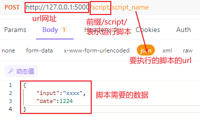

# 项目名称
轻量级动态部署框架
## 项目介绍
旨在于实现一个支持动态部署脚本，可扩展的轻量级部署框架

框架主要目的是实现一个接口的热更新，能够以较小的代价进行接口的更新，同时扩展任务链相关的功能，来方便接入到已有的业务逻辑中，本身可以算是对现在的cicd流程的补充

## 目录结构描述
```
前端
|-- .gitignore
|-- index.html
|-- jsconfig.json
|-- package-lock.json
|-- package.json
|-- README.md
|-- vite.config.js
|-- public
|   |-- favicon.ico
|-- src
    |-- App.vue
    |-- main.js
    |-- router.js
    |-- utils.js
    |-- api
    |   |-- chain_api.js
    |   |-- config.js
    |   |-- file_api.js
    |   |-- package_api.js
    |   |-- script_api.js
    |-- assets
    |   |-- logo.svg
    |-- components
    |   |-- ChainInformation.vue
    |   |-- ChainUpload.vue
    |   |-- FileColumns.vue
    |   |-- FileDrawer.vue
    |   |-- FileUpload.vue
    |   |-- NameSpaceTree.vue
    |   |-- PackageColumns.vue
    |   |-- PackageInstall.vue
    |   |-- ResultShow.vue
    |   |-- RuntimeColumns.vue
    |   |-- RuntimeDrawer.vue
    |   |-- ScriptDrawer.vue
    |   |-- ScriptInformation.vue
    |   |-- ScriptUpload.vue
    |-- content
    |   |-- Empty.vue
    |   |-- FileManagement.vue
    |   |-- ScriptManagement.vue
    |-- menu
    |   |-- FuncMenu.vue
    |-- panels
        |-- FileManagePanel.vue
        |-- PackagePanel.vue
        |-- ResultInfo.vue
        |-- RuntimePanel.vue
        |-- ScriptPanel.vue
        |-- TaskChainPanel.vue

```
```
后端
├─api                                                                  
│  └─__init__.py
│  └─app.py
│  └─FileApi.py
│  └─PackageApi.py
│  └─ScriptApi.py
│  └─TaskChainApi.py
├─config
│  └─__init__.py
│  └─ConfigLoader.py
│  └─ConfigStructure.py
│  └─default.ini
│  └─mongo_collection_config.yaml 
├─utils
│  └─__init__.py
│  └─base.py
│  └─CacheFile.py
│  └─CacheManager.py
│  └─Logging.py
│  └─MongoManager.py
│  └─TaskChain.py
│  └─TaskPool.py
├─main.py    
├─README.md
├─requirements.txt  #需要的包
```
# 使用说明
## 配置
前端：
1.克隆仓库到本地<br>
2.在config.js中填s3的token（如果修改端口号等也在config中修改）<br>
后端：<br>
1.克隆仓库到本地<br>
2.将requirements.txt中的包安装好<br>
3.连接数据库：填写dafault.ini中数据库的信息，就会连接到你的数据库上（运行时将会自动在数据库中创建需要的集合）<br>
4.在main.py中可修改IP地址，端口号<br>

## 使用
连接好数据库，前后端开始运行。<br>
1.直接到前端界面中操作<br>
2.执行脚本、任务链：<br>
* 执行脚本：


* 执行任务链：如上，将前缀换成/task_chain/，加上任务链的url，填写第一个任务需要的数据即可。
